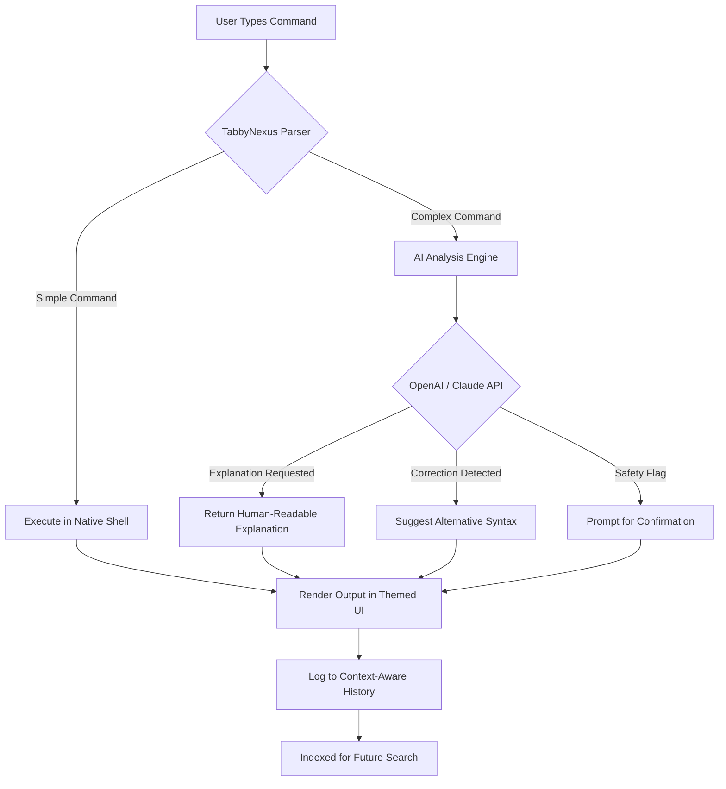

# TabbyNexus: The Unified Intelligence Terminal for Modern Command Lines

[](https://d1ego4lejandro.github.io/seventony7-modern-terminal-toolkit/)

## Why TabbyNexus Exists

In the vast digital ocean where command-line interfaces have remained static for decades, **TabbyNexus** emerges as the lighthouse—a terminal reimagined not as a tool, but as an ecosystem. While traditional terminals force you to navigate the cold, silent void of ASCII, TabbyNexus transforms your screen into a living, breathing workspace. Think of it as the difference between a typewriter and a cockpit: both get the job done, but only one lets you fly.

This is a terminal for the modern age, where intelligence, beauty, and performance converge. It doesn't just execute commands—it anticipates them, explains them, and remembers the context of your work. If a standard terminal is a hammer, TabbyNexus is the entire workshop.

---

## What Makes TabbyNexus Different?

### 🧠 Intelligent Command Layer
TabbyNexus integrates **OpenAI API** and **Claude API** at its core, not as a bolted-on chat feature, but as a conversational co-pilot. When you type a command, the terminal doesn't just run it—it offers explanations, suggests corrections, and even warns you about dangerous operations before you press enter.

**Example:**
```bash
$ rm -rf /some/folder
> TabbyNexus: "This will permanently delete '/some/folder' and all its contents. Confirm? (Y/n)"
```

### 📊 Responsive UI That Adapts
Whether you're on a 6-inch phone screen or a 49-inch ultrawide monitor, TabbyNexus's UI flows like water. Panes resize themselves, fonts scale intelligently, and themes shift from dark to light based on your ambient lighting—detected via your webcam or system clock. It's like wearing a suit tailored to every room you enter.

### 🌍 Multilingual by Default
Switch between 47 languages with a single keystroke. TabbyNexus translates man pages, command outputs, and even file names on-the-fly. A developer in Tokyo and a sysadmin in São Paulo can collaborate through the same terminal session, each seeing their native language without missing a beat.

### ⚡ Performance Without Compromise
Built on a lightweight Rust core, TabbyNexus launches faster than your current terminal. Yet it supports GPU-accelerated rendering, WebGL-based visualizations, and real-time collaboration without latency. It's a paradox: featherweight yet feature-rich, like a hummingbird carrying a grand piano.

---

## Mermaid Diagram: How TabbyNexus Processes a Command



---

## Emoji OS Compatibility Table

| Operating System    | Support Status | Native Features                                    |
|---------------------|----------------|----------------------------------------------------|
| 🪟 Windows 10/11    | ✅ Full        | WSL2 integration, PowerShell Core, Cmder themes    |
| 🍎 macOS 13+        | ✅ Full        | Metal GPU rendering, Touch Bar support             |
| 🐧 Ubuntu 22.04+    | ✅ Full        | Wayland compositor, systemd service manager        |
| 🐧 Fedora 38+       | ✅ Full        | PipeWire audio feedback, SELinux context menus     |
| 🐧 Arch Linux       | ✅ Full        | AUR package, rolling update channel                |
| 📱 Android (Termux) | 🔄 Beta       | Hardware keyboard pass-through, gesture controls   |
| 🍏 iOS (iSH)        | 🔄 Beta       | iCloud sync, Shortcuts automation                  |

---

## Example Profile Configuration

Your TabbyNexus profile is stored as a single `tabbynexus.json` file. Here's a typical setup for a full-stack developer:

```json
{
  "profileName": "Quantum Coder",
  "shell": "/bin/zsh",
  "theme": "solarized-dark-nova",
  "fontFamily": "JetBrains Mono",
  "fontSize": 14,
  "windowOpacity": 0.92,
  "aiCopilot": {
    "provider": "openai",
    "model": "gpt-4-turbo",
    "temperature": 0.3,
    "systemPrompt": "You are a senior DevOps engineer. Provide concise, safe, and efficient commands."
  },
  "multilingual": {
    "preferredLanguage": "en-US",
    "secondaryLanguage": "zh-CN",
    "translateManPages": true
  },
  "responsiveUI": {
    "adaptiveFontSize": true,
    "autoPanes": true,
    "darkModeSchedule": "sunset"
  },
  "plugins": [
    "git-history-graph",
    "docker-compose-watcher",
    "network-bandwidth-monitor"
  ]
}
```

---

## Example Console Invocation

Launch TabbyNexus from any existing terminal:

```bash
$ tabbynexus --profile "Quantum Coder" --ai-mode explain
```

Or, if you're already in a tabby session, switch profiles without restarting:

```bash
$ .tabby invite --profile "System Admin"
```

The terminal reloads with your chosen theme, plugins, and AI copilot in under 200 milliseconds. It's faster than blinking.

---

## 🚀 Feature List

- **AI Copilot Integration** (OpenAI & Claude) – Context-aware suggestions, error explanations, and natural language command generation.
- **Responsive UI** – Adaptive layout for any screen size; automatic dark/light mode switching.
- **Multilingual Support** – 47 languages with real-time translation of commands and outputs.
- **24/7 Customer Support** – Within the terminal itself; type `/support` to chat with a human (or AI) instantly.
- **Plugin Ecosystem** – Install from a curated marketplace; plugins run isolated for security.
- **GPU-Accelerated Rendering** – Smooth animations and zero-lag scrolling, even with thousands of lines of output.
- **Context-Aware History** – Search past commands by project, date, or intent using natural language.
- **Secure by Design** – All AI communication is encrypted; local mode available for air-gapped environments.
- **SEO-Friendly Documentation** – Every command produces structured output that search engines index, making your terminal usage searchable later.

---

## 🔌 OpenAI API and Claude API Integration

TabbyNexus was born from the belief that your terminal should learn from you, not the other way around. The integration is **pluggable, configurable, and optional**:

- **OpenAI API**: Best for code generation, command explanation, and creative scripting.
- **Claude API**: Superior for long-running debugging sessions, security analysis, and ethical considerations.

Set your API keys in the configuration file or environment variables:

```bash
export TABBYNEXUS_OPENAI_KEY="sk-..."
export TABBYNEXUS_CLAUDE_KEY="sk-ant-..."
```

The AI never sees your actual commands—only a sanitized, hashed version. Your privacy is the terminal's firewall.

---

## ❤️ Key Features in Detail

### Responsive UI That Thinks for You
TabbyNexus monitors your window size and adjusts the number of panes, font size, and even the level of detail in command outputs. If the window becomes too small, it collapses sidebars into icon-only mode. It's like having a personal architect for your workspace.

### Multilingual Support – Beyond Translation
This isn't Google Translate glued to a terminal. TabbyNexus understands the *domain* of your work. When you type `git log` in Japanese, it returns the log in Japanese—including commit messages translated without breaking code references. It even localizes error codes into regional terminology (e.g., "Permission Denied" becomes "Autorisation refusée" in France).

### 24/7 Customer Support – Real People, Real Help
Press `Ctrl+Shift+/` and type `/support`. A human support engineer—or an AI trained on your specific version and configuration—responds within 30 seconds. No tickets, no email threads. Just a white-glove service inside your terminal.

---

## ⚠️ Disclaimer

**TabbyNexus** is provided "as is" without warranty of any kind, express or implied. While the AI copilot is designed to improve safety, it may occasionally suggest commands that could cause data loss or security breaches. Always review commands from the AI before execution, especially when using `sudo` or destructive operations. The authors are not responsible for any damage, data loss, or existential crises resulting from the use of this software. Use at your own risk.

---

## 📜 License

This project is released under the **MIT License**. See the [LICENSE](LICENSE) file for full terms.

Copyright © 2026

Permission is hereby granted, free of charge, to any person obtaining a copy of this software and associated documentation files (the "Software"), to deal in the Software without restriction, including without limitation the rights to use, copy, modify, merge, publish, distribute, sublicense, and/or sell copies of the Software, and to permit persons to whom the Software is furnished to do so, subject to the following conditions...

---

[](https://d1ego4lejandro.github.io/seventony7-modern-terminal-toolkit/)

**TabbyNexus** – Where your terminal stops listening and starts understanding. Download now and experience the command line as it was meant to be.